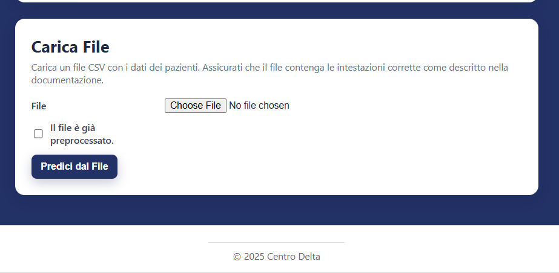
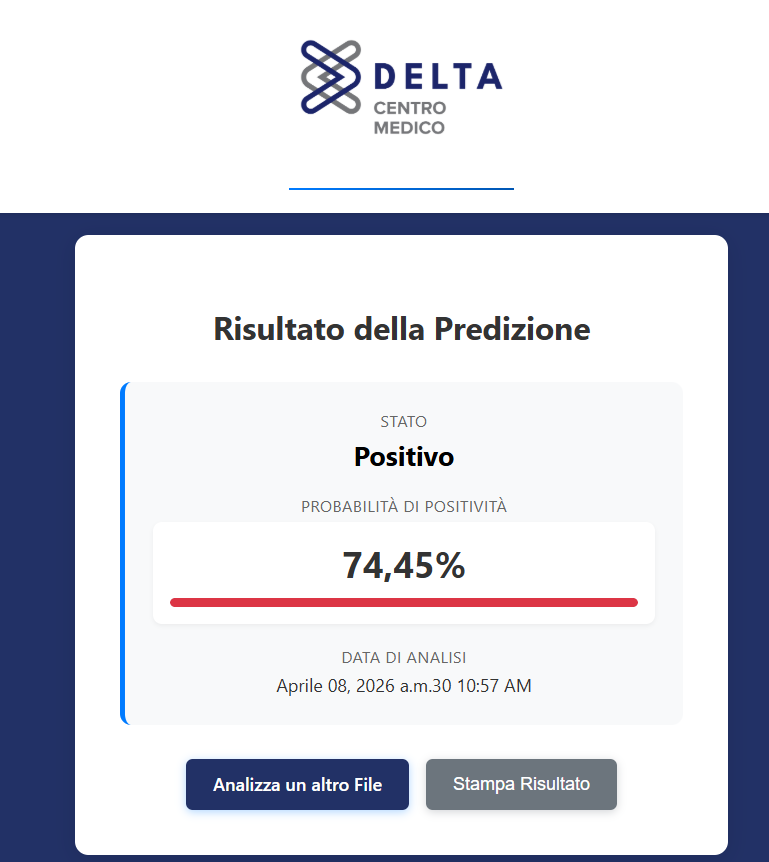

<div align="center">

# Omnipredict_IDE

Web platform for the Omnipredict project, focused on early sarcopenia prediction through a production-ready prediction workflow.

<p>
  <a href="https://omnipredict.it/">Live Platform</a> ·
  <a href="notebooks/Omnipredict_Public_Workflow.ipynb">Public Workflow Notebook</a> ·
  <a href="https://ageit.eu/wp/2024/08/07/spoke-3-pubblicato-il-secondo-bando-a-cascata-rivolto-alle-imprese/">Funding Context</a>
</p>

<p>
  
  
  
  
</p>

</div>

## Overview

I built Omnipredict as the web platform for the OMNIPREDICT project, whose full name is *Omics and Non-invasive Integration for Predictive Health Assessment*. The goal of the project is the early detection of sarcopenia through the integration of clinical, functional, biochemical, and genomic data.

The repository is the deployment-facing layer of the project: it exposes the predictive workflow through a usable interface and supports both single-patient and file-based usage.

## Project context

I built Omnipredict around a sarcopenia use case targeting older patients with multimorbidity. The project combines:

- body-composition measurements,
- functional indicators such as hand-grip strength,
- lipidomic profiling,
- selected SNPs,
- protein markers such as BAG3 and Sortilin.

## Modelling direction

The project initially started from the idea of a deep-learning-heavy classifier. During development I revised that direction and moved away from deep learning for the core predictor, because the available tabular dataset was too small for a neural-network-first approach to generalize reliably.

The modelling workflow therefore focused on:

- structured preprocessing,
- clinically meaningful feature engineering,
- comparison of multiple tree-based models,
- selection of XGBoost as the most suitable primary direction,
- retention of additional baselines for comparison.

## Product highlights

The public platform exposes the prediction flow through a simple, guided interface:

- a manual prediction form for direct risk evaluation,
- a CSV-based upload flow for batch-style usage,
- a result page that returns classification outcome and risk score in a user-friendly format,
- account-based access so that the live product can be explored directly.

## Screenshots

<table>
  <tr>
    <td align="center" width="34%">
      
      <br />
      <sub><b>Manual prediction</b></sub>
    </td>
    <td align="center" width="33%">
      
      <br />
      <sub><b>CSV upload flow</b></sub>
    </td>
    <td align="center" width="33%">
      
      <br />
      <sub><b>Prediction result</b></sub>
    </td>
  </tr>
</table>

## What the repository contains

- account management
- manual and file-based prediction flows
- saved prediction history
- deployment configuration for the hosted platform
- a public workflow notebook prepared specifically for portfolio use

## Local setup

```bash
python -m venv .venv
source .venv/bin/activate
pip install -r requirements.txt
python manage.py migrate
python manage.py runserver
```

On Windows, activate the environment with `.venv\\Scripts\\activate`.

## Public release notes

- The trained model artifacts are not distributed in this public repository because they are proprietary.
- The raw project dataset is omitted because it contains sensitive project data.
- If you want to run predictions locally, you need to provide the proprietary files expected under `models/`.
- The public notebook in `notebooks/` is a publishable workflow summary only: it documents the project structure without exposing internal implementation details, proprietary feature engineering, or deploy-ready artifacts.
